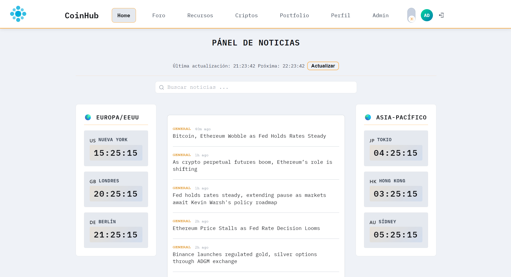
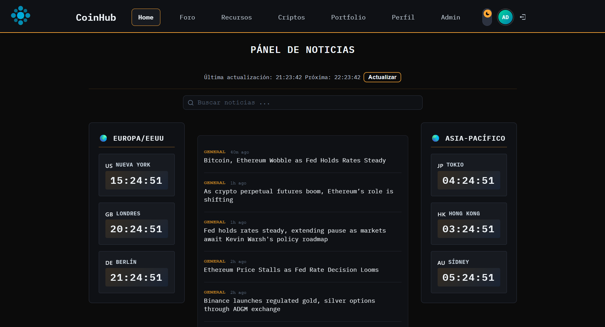
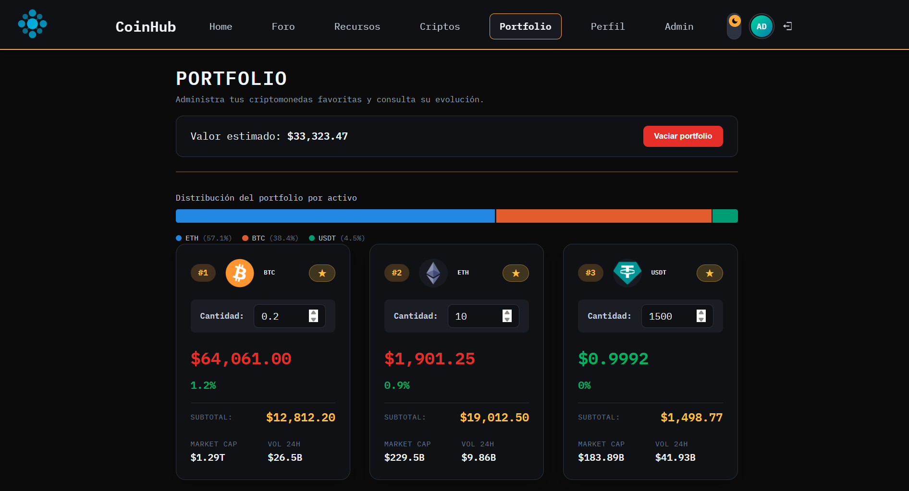
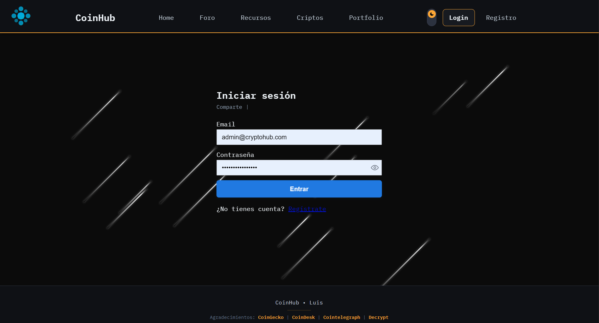

[](https://github.com/Luis-Git-AC/CoinHub/actions/workflows/ci.yml)

# CoinHub

CoinHub es una plataforma para usuarios interesados en criptomonedas: consulta de precios y noticias, gestión de un portfolio personal y un foro de posts/comentarios/recursos con roles de usuario. Combina un frontend en React con un backend en Node/Express + MongoDB que centraliza persistencia, autenticación y subida de archivos.

## Migración de JavaScript a TypeScript

El proyecto nació en JavaScript (React + Express) y ha sido **migrado íntegramente a TypeScript**, tanto en frontend como en backend:

- Tipado estricto (`strict: true`) en los dos `tsconfig.json`, con `moduleResolution: node16` en el backend y `bundler` en el frontend. El frontend además activa `noUncheckedIndexedAccess`.
- 0 ficheros `.js`/`.jsx` de código de aplicación: todo el backend (rutas, controladores, modelos, middlewares, scripts de utilidades y seed) y todo el frontend (componentes, páginas, hooks, servicios) están en `.ts`/`.tsx`.
- Validación en runtime con **Zod** en los módulos de auth, posts y portfolio, infiriendo los tipos estáticos desde el propio esquema (una sola fuente de verdad en vez de duplicar validador + interfaz).
- `portfolio` se reestructuró además como caso de estudio de **Clean Architecture** (Controller → Service → Repository), documentado en el README del backend.
- `npm run typecheck` (`tsc --noEmit`) pasa sin errores en ambos paquetes, verificado en CI.

## Capturas de pantalla

> Pendiente de añadir las imágenes en `docs/screenshots/` (ver detalle de qué capturar en `frontend/README.md` y `backend/README.md`). Máximo 8 capturas en todo el proyecto — ver el listado completo más abajo.

| Home — tema claro | Home — tema oscuro |
| --- | --- |
|  |  |





## Estructura del proyecto

```
RTC-Proyecto-Final-Coinhub/
├── backend/    # API Node + Express + TypeScript + MongoDB
├── frontend/   # SPA React + TypeScript + Vite
├── docker-compose.yml
└── insomnia/   # Colección de requests de ejemplo para probar la API
```

Documentación específica de cada parte:

- [`backend/README.md`](../RTC-Proyecto-Final-Coinhub/backend/README.md) — API, endpoints, autenticación, seguridad, tests.
- [`frontend/README.md`](../RTC-Proyecto-Final-Coinhub/frontend/README.md) — páginas, componentes, tema claro/oscuro, PWA, tests.

## Despliegue

- Frontend (producción): https://coin-hub-frontend-tau.vercel.app/
- Backend (producción): https://coin-hub-backend.vercel.app/ — health check en `/api/health`

## Arranque rápido (local)

Requiere Node.js 22+, una instancia de MongoDB (Atlas o local) y credenciales de Cloudinary (solo necesarias para subir imágenes).

```bash
npm run install:all   # instala backend y frontend
npm run dev            # levanta ambos en paralelo (backend :5000, frontend :5173)
```

Cada paquete necesita su propio `.env` — ver el detalle de variables en el README de `backend/` y `frontend/`.

### Alternativa: Docker

```bash
cd RTC-Proyecto-Final-Coinhub
docker-compose up --build
```

Levanta MongoDB, backend (puerto 5000) y frontend (puerto 8080) en un solo comando. La subida de imágenes no funcionará sin credenciales reales de Cloudinary en `docker-compose.yml`.

## Stack tecnológico

**Frontend:** React 19, TypeScript, Vite, React Router, TanStack Query, CSS Modules, Vitest + Testing Library, Playwright (E2E), `vite-plugin-pwa`.

**Backend:** Node.js, Express 5, TypeScript, MongoDB + Mongoose, Zod, JWT (cookies httpOnly), Cloudinary, Pino (logging estructurado), Vitest + Supertest + `mongodb-memory-server`.

## Testing y CI

Ambos paquetes tienen suite de tests (Vitest) y typecheck limpio. El repositorio incluye un workflow de GitHub Actions (`.github/workflows/ci.yml`) que en cada push/PR a `main`/`develop` ejecuta, en paralelo para frontend y backend: `typecheck → lint → build → test`. El detalle de qué cubre cada suite está en el README de cada paquete.

## Documentación de la API

El backend expone documentación interactiva de la API generada desde los esquemas Zod en `/api-docs` (Swagger UI) — ver detalles en `backend/README.md`. También se incluye una colección de Insomnia (`insomnia/insomnia_collection.json`) con requests preconfigurados para todos los módulos, útil para explorar y probar la API sin escribir peticiones a mano.

## Seguridad (resumen)

- Sesión en cookies `httpOnly` (access token de 15 min + refresh token de 7 días, rotado), no en `localStorage`.
- Protección CSRF mediante cabecera custom obligatoria en peticiones que mutan estado.
- `helmet` para cabeceras HTTP de seguridad y `express-rate-limit` (límite reforzado en login/registro).
- Revocación de sesiones vía `tokenVersion` al cambiar contraseña.

El detalle completo está en `backend/README.md`.
