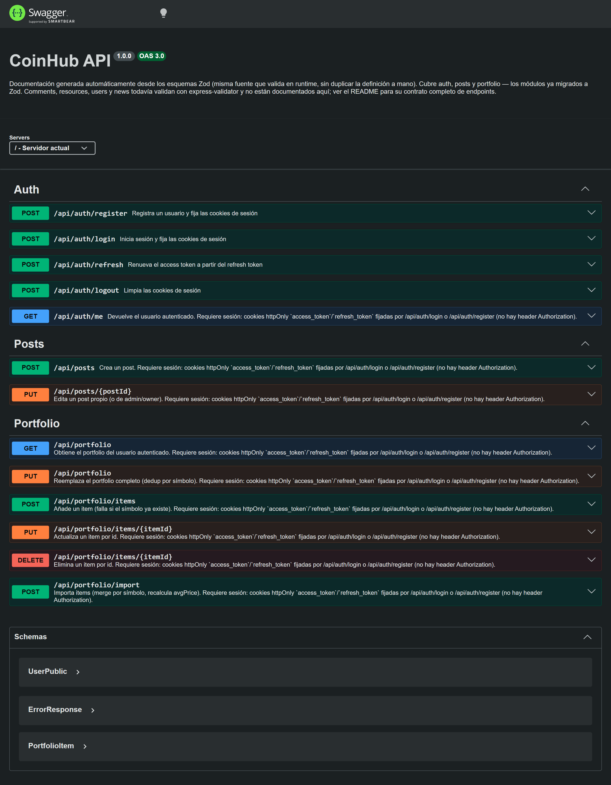

# CoinHub Backend (API)

API REST construida con Node.js + Express + MongoDB (Mongoose). Gestiona autenticación, usuarios/roles, posts, comentarios, recursos (subida a Cloudinary y proxy open/download), portfolio y un agregador de noticias cripto.

## Migración de JavaScript a TypeScript

Todo el backend (rutas, controladores, modelos, middlewares, scripts de utilidades y el seed) está migrado a TypeScript con `strict: true` y `moduleResolution: node16`. No queda código de aplicación en `.js`. Además de tipado estático:

- **Validación en runtime con Zod** en auth, posts y portfolio (esquemas en `API/schemas/`), infiriendo los tipos TypeScript directamente del esquema — una sola fuente de verdad en vez de mantener un validador y una interfaz por separado.
- **Interfaces de negocio puras** en `types/models.ts` (sin heredar de `Document` de Mongoose); `HydratedDocument<T>` se usa solo donde de verdad se instancia un documento (repositorio/servicio).
- **Caso de estudio de Clean Architecture en `portfolio`**: es el único módulo con capas `Controller → Service → Repository` (`API/services/PortfolioService.ts`, `API/repositories/PortfolioRepository.ts`). Los otros 6 módulos (auth, users, posts, comments, resources, news) usan un controlador que habla directamente con el modelo — patrón razonable al tamaño de este proyecto; portfolio existe como demostración acotada del patrón, no aplicado uniformemente sin criterio.
- `npm run typecheck` (`tsc --noEmit`) pasa sin errores, verificado en CI.

## Capturas de pantalla



## Despliegue

- URL (producción): https://coin-hub-backend.vercel.app/
- Health check: `GET /api/health`
- Documentación interactiva de la API: `GET /api-docs` (Swagger UI, generado desde los esquemas Zod de auth/posts/portfolio; los demás módulos validan con `express-validator` y no están en este documento — su contrato completo está en las tablas de abajo)

## Requisitos

- Node.js 22+
- Una instancia de MongoDB (Atlas o local)
- Credenciales de Cloudinary (solo necesarias para subir imágenes en posts/recursos)

## Instalación y ejecución (local)

```bash
cd backend
npm install
npm run dev
```

Servidor local por defecto: `http://localhost:5000`.

### Variables de entorno (`backend/.env`)

| Variable | Requerida | Descripción |
| --- | --- | --- |
| `MONGODB_URI` | Sí | Cadena de conexión a MongoDB |
| `JWT_SECRET` | Sí | Secreto para firmar los tokens de acceso y refresco |
| `CLOUDINARY_CLOUD_NAME` | Sí | Cuenta de Cloudinary |
| `CLOUDINARY_API_KEY` | Sí | Cuenta de Cloudinary |
| `CLOUDINARY_API_SECRET` | Sí | Cuenta de Cloudinary |
| `PORT` | No (default `5000`) | Puerto del servidor |
| `FRONTEND_URLS` | No (default `http://localhost:5173`) | Orígenes permitidos por CORS, separados por comas |

El proceso valida estas variables al arrancar (`config/env.ts`) y termina con un mensaje claro si falta alguna requerida.

## Autenticación

La sesión **no** viaja en un header `Authorization`, sino en dos cookies `httpOnly` que fija el propio backend:

- `access_token` — JWT de vida corta (15 min), es el que valida el middleware `auth` en cada petición protegida.
- `refresh_token` — JWT de vida larga (7 días), solo se usa contra `POST /api/auth/refresh` para renovar el access token sin pedir credenciales de nuevo.

Cambiar la contraseña incrementa `tokenVersion` en el usuario, lo que revoca inmediatamente cualquier token (access o refresh) emitido antes de ese momento.

Como las cookies son `httpOnly`, el cliente debe:

- Enviar `credentials: 'include'` en cada `fetch`.
- Añadir la cabecera `X-Requested-With: XMLHttpRequest` en toda petición que mute estado (`POST`/`PUT`/`PATCH`/`DELETE`) — es la protección CSRF que exige `middleware/csrf.ts`, necesaria porque las cookies usan `SameSite=None` en producción (frontend y backend están en subdominios distintos de vercel.app).

| Endpoint | Descripción |
| --- | --- |
| `POST /api/auth/register` | Crea usuario, fija las cookies de sesión y devuelve `{ message, user }` |
| `POST /api/auth/login` | Verifica credenciales, fija las cookies de sesión y devuelve `{ message, user }` |
| `POST /api/auth/refresh` | Renueva el access token a partir del refresh token |
| `POST /api/auth/logout` | Limpia las cookies de sesión |
| `GET /api/auth/me` | Devuelve el usuario autenticado a partir de la cookie |

## Endpoints

Base path: todos los endpoints cuelgan de `/api`. La columna **Auth** indica si se requiere sesión (cookie `access_token` válida), no un header manual.

### Auth (`/api/auth`)

| Método | Ruta | Auth | Rol | Body | Resumen |
| --- | --- | --- | --- | --- | --- |
| POST | `/api/auth/register` | No | — | JSON | Registra usuario y fija cookies de sesión |
| POST | `/api/auth/login` | No | — | JSON | Login y fija cookies de sesión |
| POST | `/api/auth/refresh` | No* | — | — | Renueva el access token (*requiere cookie `refresh_token`) |
| POST | `/api/auth/logout` | No | — | — | Limpia las cookies de sesión |
| GET | `/api/auth/me` | Sí | user/admin/owner | — | Devuelve el usuario autenticado |

**Body register (JSON):** `username`, `email`, `password`, `wallet_address` (opcional)

**Body login (JSON):** `email`, `password`

---

### Users (`/api/users`)

| Método | Ruta | Auth | Rol | Body | Resumen |
| --- | --- | --- | --- | --- | --- |
| GET | `/api/users/profile` | Sí | user/admin/owner | — | Obtiene el perfil del usuario autenticado |
| PUT | `/api/users/profile` | Sí | user/admin/owner | JSON o `multipart/form-data` | Actualiza perfil (username/email/wallet y avatar) |
| PUT | `/api/users/profile/password` | Sí | user/admin/owner | JSON | Cambia contraseña (revoca sesiones incrementando `tokenVersion`) |
| DELETE | `/api/users/profile` | Sí | user/admin | JSON | Auto-elimina cuenta y contenido (owner **no** puede) |
| GET | `/api/users` | Sí | admin/owner | — | Lista usuarios (paginado). Query: `page`, `limit`, `role` |
| GET | `/api/users/:userId` | No | — | — | Obtiene un usuario público (sin email) |
| PUT | `/api/users/:userId/role` | Sí | admin/owner | JSON | Cambia rol del usuario (solo `user`/`admin`) |
| DELETE | `/api/users/:userId` | Sí | admin/owner | — | Elimina un usuario y su contenido (con restricciones por rol) |

**Notas de permisos:**

- No puedes eliminar tu propio usuario desde el endpoint admin (`DELETE /api/users/:userId`).
- Un `admin` (y un `user`) sí puede auto-eliminar su cuenta desde `DELETE /api/users/profile` aportando `currentPassword`.
- No se puede eliminar a un `owner`. Solo `owner` puede eliminar o despromocionar a un `admin`.
- `owner` no puede auto-eliminar su cuenta desde perfil.

**Body change password (JSON):** `currentPassword`, `newPassword` (mín. 16), `confirmPassword`

**Body delete account (JSON):** `currentPassword`

**Body change role (JSON):** `role` (`user` o `admin`)

---

### Posts (`/api/posts`)

| Método | Ruta | Auth | Rol | Body | Resumen |
| --- | --- | --- | --- | --- | --- |
| GET | `/api/posts` | No | — | — | Lista posts (paginado). Query: `page`, `limit`, `category`, `userId` |
| GET | `/api/posts/:postId` | No | — | — | Obtiene un post |
| POST | `/api/posts` | Sí | user/admin/owner | `multipart/form-data` (campo `image` opcional) o JSON | Crea post |
| PUT | `/api/posts/:postId` | Sí | owner del post o admin/owner | `multipart/form-data` (campo `image` opcional) o JSON | Edita post |
| DELETE | `/api/posts/:postId` | Sí | owner del post o admin/owner | — | Elimina post |
| POST | `/api/posts/:postId/like` | Sí | user/admin/owner | — | Alterna like/unlike |

**Body post (JSON):** `title`, `content`, `category` (valores: `análisis`, `tutorial`, `experiencia`, `pregunta`)

---

### Comments (`/api/comments`)

| Método | Ruta | Auth | Rol | Body | Resumen |
| --- | --- | --- | --- | --- | --- |
| GET | `/api/comments` | No | — | — | Lista comentarios. Query: `postId`, `userId`, `page`, `limit` |
| GET | `/api/comments/:commentId` | No | — | — | Obtiene un comentario |
| POST | `/api/comments` | Sí | user/admin/owner | JSON | Crea comentario |
| PUT | `/api/comments/:commentId` | Sí | owner del comentario | JSON | Edita comentario |
| DELETE | `/api/comments/:commentId` | Sí | owner del comentario o admin | — | Elimina comentario |

**Body create/update (JSON):** `content` (+ `postId` al crear)

---

### Resources (`/api/resources`)

| Método | Ruta | Auth | Rol | Body | Resumen |
| --- | --- | --- | --- | --- | --- |
| GET | `/api/resources` | No | — | — | Lista recursos. Query: `page`, `limit`, `type`, `category`, `userId` |
| GET | `/api/resources/:resourceId` | No | — | — | Obtiene un recurso |
| GET | `/api/resources/:resourceId/open` | No | — | — | Devuelve el archivo en streaming (proxy) |
| GET | `/api/resources/:resourceId/download` | No | — | — | Fuerza descarga del archivo (proxy) |
| POST | `/api/resources` | Sí | user/admin/owner | `multipart/form-data` (campo `file` obligatorio) | Crea recurso |
| PUT | `/api/resources/:resourceId` | Sí | owner del recurso o admin/owner | `multipart/form-data` (campo `file` opcional) | Edita recurso |
| DELETE | `/api/resources/:resourceId` | Sí | owner del recurso o admin/owner | — | Elimina recurso |

**Body resource (form-data):** `title`, `description`, `type` (`pdf`, `image`, `guide`), `category` (`análisis-técnico`, `fundamentos`, `trading`, `seguridad`, `defi`, `otro`), `file` (obligatorio al crear)

---

### Portfolio (`/api/portfolio`)

| Método | Ruta | Auth | Rol | Body | Resumen |
| --- | --- | --- | --- | --- | --- |
| GET | `/api/portfolio` | Sí | user/admin/owner | — | Obtiene items del portfolio |
| PUT | `/api/portfolio` | Sí | user/admin/owner | JSON | Reemplaza portfolio (dedup por símbolo) |
| POST | `/api/portfolio/items` | Sí | user/admin/owner | JSON | Añade item (si no existe) |
| PUT | `/api/portfolio/items/:itemId` | Sí | user/admin/owner | JSON | Actualiza item por id |
| DELETE | `/api/portfolio/items/:itemId` | Sí | user/admin/owner | — | Elimina item por id |
| POST | `/api/portfolio/import` | Sí | user/admin/owner | JSON | Importa items (merge y recalcula `avgPrice`) |

**Body PUT /api/portfolio (JSON):** `{ items: Array<{ symbol, amount, avgPrice, notes?, metadata? }> }`

---

### News (`/api/news`)

| Método | Ruta | Auth | Rol | Body | Resumen |
| --- | --- | --- | --- | --- | --- |
| GET | `/api/news` | No | — | — | Devuelve `{ items }`: hasta 40 noticias cripto recientes |

No es un proxy a un servicio de terceros con API key: el backend descarga y parsea (con `rss-parser`) los feeds RSS de **CoinDesk**, **Cointelegraph** y **Decrypt**, los normaliza a un formato común, los mezcla y los ordena por fecha. Si una fuente falla, se ignora solo esa (`Promise.allSettled`) sin afectar a las demás.

## Estructura y responsabilidades (ficheros clave)

- `server.ts` — orquesta la API: valida variables de entorno (`config/env.ts`), conecta con MongoDB (`config/db.ts`), aplica `helmet`, logging con Pino, `express-rate-limit`, CORS según `FRONTEND_URLS`, protección CSRF y monta routers.
- `config/cloudinary.ts` — subir/eliminar archivos en Cloudinary (`upload_stream` sobre buffers).
- `middleware/auth.ts` — valida el JWT de la cookie `access_token`, reconstruye `req.user`/`req.userId` y comprueba `tokenVersion`.
- `middleware/csrf.ts` — exige la cabecera `X-Requested-With` en peticiones que mutan estado.
- `middleware/upload.ts` — `multer` en memoria, valida MIME types (imágenes y PDF) y limita a 10MB.
- `middleware/validate.ts` — valida `req.body` contra un esquema Zod y sustituye el body por los datos ya parseados/transformados.
- `middleware/errorHandler.ts` — manejador global; distingue errores operacionales (`AppError`, log `warn`) de bugs (log `error`, mensaje genérico en producción).
- `utils/tokens.ts` — firma/verifica los JWT de access y refresh, y fija/limpia las cookies httpOnly.

### Modelos (`backend/API/models`)

- `User` — `username`, `email`, `password` (hash), `avatar`, `wallet_address`, `role` (`user`/`admin`/`owner`), `tokenVersion`.
- `Post` — `userId`, `title`, `content`, `category`, `image` (Cloudinary), `likes` (array de `User._id`).
- `Comment` — `postId`, `userId`, `content`.
- `Resource` — `userId`, `title`, `description`, `type`, `fileUrl` (Cloudinary), `originalName`, `category`.
- `Portfolio` — documento único por `userId` con `items` (symbol, amount, avgPrice, metadata).

## Seguridad

- `helmet` para cabeceras HTTP de seguridad (`Content-Security-Policy`, `X-Frame-Options`, `Strict-Transport-Security`...).
- Rate limiting: 300 peticiones / 15 min en toda la API; 20 intentos / 15 min específicamente en `/api/auth/login` y `/api/auth/register`.
- Sesión en cookies `httpOnly` + protección CSRF por cabecera custom (ver sección Autenticación).
- Revocación de sesiones vía `tokenVersion` al cambiar contraseña.
- Límite de subida de archivos: 10MB y control estricto de MIME types.
- Eliminación de archivos en Cloudinary al actualizar/eliminar recursos.
- Variables de entorno validadas al arrancar; el proceso termina con mensaje claro si falta alguna.

## Testing

Suite con **Vitest** + **Supertest** + `mongodb-memory-server` (base de datos en memoria, sin depender de MongoDB Atlas):

- `test/auth.test.ts` — registro (201 con cookies, 400 en duplicado/campos inválidos) y login (200, 401 en credenciales incorrectas).
- `test/middleware-auth.test.ts` — sin token, formato incorrecto, JWT malformado/inválido/expirado, `tokenVersion` revocada, token válido pasa al siguiente handler.
- `test/portfolio.test.ts` — GET vacío, PUT normaliza símbolos a mayúsculas y deduplica, sobrescribe en segunda llamada, 401 sin sesión.

```bash
npm test        # una sola ejecución
npm run test:watch
```

## Seed

Pobla la base de datos con datos de ejemplo desde CSVs en `seed/data`:

```bash
npm run seed
```

## Docker

```bash
cd RTC-Proyecto-Final-Coinhub
docker-compose up --build
```

## Scripts (`package.json`)

| Script | Descripción |
| --- | --- |
| `npm run dev` | Servidor de desarrollo (`tsx watch`) |
| `npm run build` | Compila a `dist/` (`tsc`) |
| `npm start` | Ejecuta el build compilado |
| `npm run typecheck` | `tsc --noEmit` |
| `npm run lint` | ESLint |
| `npm test` / `npm run test:watch` | Vitest |
| `npm run seed` | Puebla la BD con datos de ejemplo |
| `npm run e2e:server` | Backend real contra MongoDB en memoria, usado por los tests E2E de Playwright del frontend |
