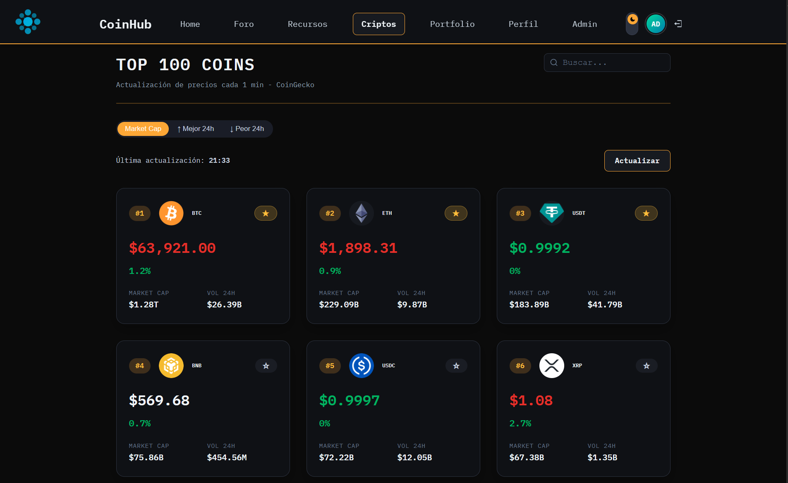
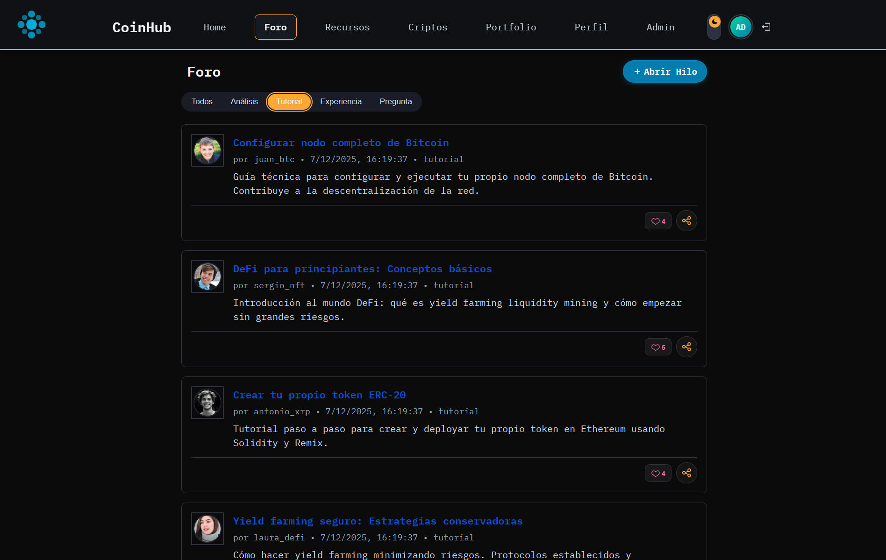
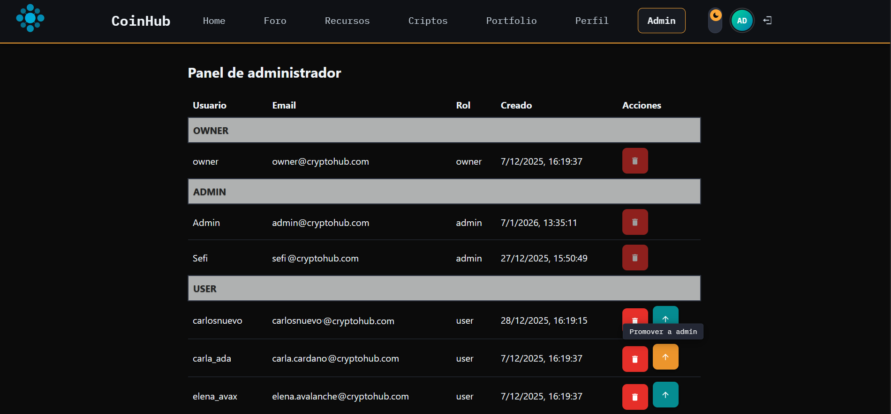

# CoinHub Frontend

Aplicación React (Vite) que consume la API de CoinHub para autenticación, mercado y noticias cripto, portfolio, posts, comentarios y recursos.

## Migración de JavaScript a TypeScript

Todo el frontend (páginas, componentes, hooks, contextos, servicios) está migrado de `.jsx`/`.js` a `.tsx`/`.ts`, con `strict: true` y `noUncheckedIndexedAccess: true` en `tsconfig.json` (obliga a manejar explícitamente que un acceso indexado pueda devolver `undefined`). `moduleResolution` es `bundler` (nativo de Vite). `npm run typecheck` pasa sin errores, verificado en CI.

## Capturas de pantalla







## Despliegue

- URL (producción): https://coin-hub-frontend-tau.vercel.app/

## Requisitos

- Node.js 22+

## Instalación y ejecución (local)

```bash
cd frontend
npm install
npm run dev
```

Servidor local por defecto: `http://localhost:5173`.

## Configuración

Variable de entorno requerida en `frontend/.env`:

- `VITE_API_URL` — base URL del backend incluyendo `/api` (ej. `http://localhost:5000/api`)

La sesión se gestiona íntegramente con cookies `httpOnly` que fija el backend — el frontend no guarda ningún token; simplemente envía `credentials: 'include'` en cada petición (ver `services/api.ts`).

## Scripts

| Script | Descripción |
| --- | --- |
| `npm run dev` | Servidor de desarrollo |
| `npm run build` | Build de producción |
| `npm run preview` | Previsualización del build |
| `npm run typecheck` | `tsc --noEmit` |
| `npm run lint` | ESLint |
| `npm run lint:css` | Stylelint (CSS y CSS Modules) |
| `npm test` / `npm run test:watch` | Vitest (unit/integración) |
| `npm run test:e2e` | Playwright (end-to-end) |

## Páginas (`frontend/src/pages`)

- **Home** (`Home.tsx`, `NoticiaCard.tsx`) — panel de noticias (`useNoticias`), búsqueda con `SearchForm`, metadatos de actualización y `WorldClocks` a ambos lados.
- **Criptos** (`Criptos.tsx`) — listado top de criptomonedas (`useCriptos`), búsqueda, refresco periódico de precios, acciones para añadir/retirar del portfolio.
- **Portfolio** (`Portfolio.tsx`) — monedas guardadas, actualizar cantidades, eliminar, vaciar; sincroniza con el backend vía `PortfolioProvider`.
- **Profile** (`Profile.tsx`) — datos personales, avatar, cambio de contraseña, eliminación de cuenta.
- **Auth** (`Login.tsx`, `Register.tsx`) — login/registro integrados con `AuthProvider`.
- **Posts** (foro): `PostsList.tsx`, `PostDetail.tsx` (like/unlike, comentarios), `PostForm.tsx` (crear/editar, imagen opcional).
- **Resources**: `ResourcesList.tsx` (con `TradingViewWidget` lazy), `ResourceDetail.tsx`, `ResourceForm.tsx` (subida obligatoria al crear).
- **Admin** (`AdminUsers.tsx`) — gestión de usuarios (listar, promover/degradar, eliminar); solo `admin`/`owner`.
- **NotFound** — página 404 con fondo animado.

## Estado y datos

- **TanStack Query** gestiona los datos de servidor (noticias, precios) — caché en memoria, revalidación en segundo plano y reintentos automáticos.
- **Context API** para estado de sesión y dominio: `AuthProvider` (sesión, sin guardar ningún token — solo pregunta al backend vía `/auth/me`), `PortfolioProvider` (portfolio local + sync), `ToastProvider`, `ConfirmProvider`.
- Hooks propios: `useCriptos`, `useNoticias`, `usePortfolio`, `useTheme`, `useInView`.
- `services/api.ts` centraliza las peticiones: `request<T>()` tipado genéricamente, reintentos automáticos en errores 5xx, `AbortController` para timeouts/cancelación y errores tipados (`ApiError`).

## Tema claro/oscuro

`useTheme` + `ThemeSwitch` (en el `Header`) alternan un atributo `data-theme` en `<html>`, persistido en `localStorage`. Las variables CSS en `src/styles/variables.css` responden tanto a `prefers-color-scheme` como al atributo manual, evitando parpadeos de contenido sin estilo.

## Componentes UI (ScrollX UI)

Varios componentes de interacción/animación se copiaron (no son una dependencia npm) desde [ScrollX UI](https://scrollxui.dev) a `src/components/ui/`, adaptados a las variables CSS del proyecto: `Skeleton` (loaders con shimmer), `AnimatedTabs`, `Pagination`, `SearchCell`, `SpotlightCard`, `Tooltip`, `StaggerChars`, `RevealText`, `StatsCount`, `TypeAnimation`, `BackgroundMeteors`. Los skeletons se usan en `CoinCard`, `PostCard` y el portfolio mientras cargan los datos.

## PWA

`vite-plugin-pwa` genera el service worker (precache de JS/CSS/HTML/SVG/fuentes, actualización automática); el manifest se sirve desde `public/`. La app es instalable y funciona con caché offline básico de la shell.

## Componentes y utilidades transversales

- `AuthGuard` protege rutas privadas: redirige a `/login` conservando la ubicación previa.
- `ErrorBoundary` (en `main.tsx`) captura errores de renderizado y muestra un fallback con botón de reintento en vez de pantalla en blanco.
- Todas las páginas secundarias se cargan con `React.lazy` + `Suspense` para reducir el bundle inicial.
- `scrollbar-gutter: stable` en `globals.css` evita el salto de layout al aparecer/desaparecer el scroll.

## Testing

- **Unit/integración** (Vitest + Testing Library): `services/api.test.ts`, `routes/AuthGuard.test.tsx`, `components/LikeButton/LikeButton.test.tsx`.
- **E2E** (Playwright, en `frontend/e2e/`): `register.spec.ts`, `portfolio.spec.ts`, `theme.spec.ts` — corren contra un backend real levantado con `npm run e2e:server` (Express + MongoDB en memoria, aislado de la base de datos real).

```bash
npm test           # unit/integración
npm run test:e2e   # end-to-end (requiere el backend de e2e levantado)
```

## Notas de despliegue

- Configuración SPA en Vercel (y `nginx.conf` para el contenedor Docker) para que las rutas de React Router funcionen tras refrescar.
